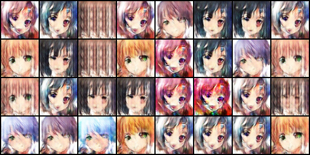

# Anime-GAN



This repository contains code for training and inference of the **GAN**(Generative adversarial network) that generates **anime faces**

## Tech stack
[](https://skillicons.dev)

## Architecture

This model is based on [DCGAN](https://arxiv.org/abs/1511.06434)


## Dataset

The dataset used for training - [Anime Faces Dataset](https://www.kaggle.com/datasets/splcher/animefacedataset)

## How to run

- install the dependencies:

```bash
pip install -r requirements.txt
```

- run the training:

```bash
python src/train.py
```

- access web interface for model inference

```bash
streamlit run src/ui.py
```

- you can access tensorboard by runnning

```bash
tensorboard --logdir=logs
```